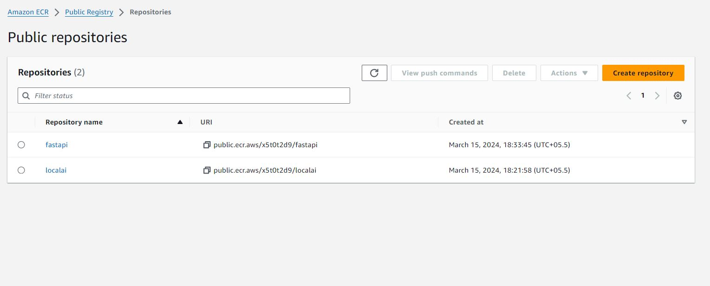

# Deployment of the multimodel inference graph using kserve

Provide an base64 image to the model and it will do the classificition base on the multimodel inference graph


![fastapi[all]](https://img.shields.io/badge/fastapi[all]-0.98.0-green)


## Objective 

- Web Search: Agent is able to search for terms on the Web
    You can use Google Search API, or Duck Duck Go Search
- Image Generation: Can generate text → image using an api call, this will be a tool, basically a function (like the weather function call) but the api will    instead return an image.
    NOTE: Since the main LLM used will not be multi-modal you cannot keep image in the conversation, so instead substitute the image with its text, but make sure to tell the LLM that it was a generated image, but you are limited to text so text was substituted.
- Python Code Interpreter: Agent should be able to write Python Code and execute when needed to answer the user queries. Agent doesn’t know any other programming language than python
- Memory: The Agent has the complete previous conversation

## Inference Model 
1. https://huggingface.co/docs/transformers/en/model_doc/mixtral
2. https://huggingface.co/WhereIsAI/UAE-Large-V1
3. https://huggingface.co/stabilityai/stable-diffusion-xl-base-1.0

## Create an EC2 Instance, 

Create an EC2 spot instance with c6a.12xlarge with 48 Cores and 256 GB memory

```
sudo apt install zip python3-pip
curl -fsSL <https://get.docker.com> -o get-docker.sh
sudo usermod -aG docker $USER
pip install jupyterlab
echo "export PATH=\\$PATH:/home/ubuntu/.local/bin" >> ~/.bashrc
```

```
conda init
tmux new -s jupyter
conda activate pytorch
jupyter lab --ip 0.0.0.0
```

## Setup LocalAI
Download Mixtral 8x7B ggml model
```
wget https://huggingface.co/TheBloke/Mixtral-8x7B-Instruct-v0.1-GGUF/resolve/main/mixtral-8x7b-instruct-v0.1.Q3_K_M.gguf
```
## Pull the LocalAI image from docker hub
```
docker pull quay.io/go-skynet/local-ai:latest
```
## Create following files:
- .env
- embeddings.yaml
- mixtral.yaml
- mixtral-chat.tmpl
- mixtral-completion.tmpl


## Setup FastAPI
Create following files:
- server.py
- requirements.txt
- Dockerfile

## Tools and Agent used
- DuckDuckGoSearchAPIWrapper - To search the current affairs from internet
- PythonREPLTool -  To write and execute the python code
- Image_Generation - Generate an image using SDXL model 
- llm_math_chain - To do the mathematical calculations
- Word_length -  To calculate the number of latters in a word

## Deployment

Create docker-compose.yml

```
docker compose build
docker compose up-d
```

You may check status of both LocalAI and FastAPI service run using below command:
```
docker compose logs -f
```

## We can test the model working:
```
curl <http://localhost:8080/embeddings> -X POST -H "Content-Type: application/json" -d '{
  "input": "Your text string goes here",
  "model": "text-embedding-ada-002"
}'

curl <http://localhost:8080/v1/chat/completions> -H "Content-Type: application/json" -d '{ "model": "mistral", "messages": [{"role": "user", "content": "How are you?"}], "temperature": 0.9 }'
```

## Push docker images into ECR repository


## EKSCTL installation
```
curl --silent --location "https://github.com/weaveworks/eksctl/releases/latest/download/eksctl_$(uname -s)_amd64.tar.gz" | tar xz -C /tmp
sudo mv /tmp/eksctl /usr/local/bin
eksctl version
```

## Create the Cluster
```
eksctl create cluster -f eks-config.yaml
```

## Install KServe with KNative and ISTIO
```
kubectl apply -f https://github.com/kubernetes-sigs/metrics-server/releases/latest/download/components.yaml

kubectl apply -f https://github.com/knative/serving/releases/download/knative-v1.11.0/serving-crds.yaml

kubectl apply -f https://github.com/knative/serving/releases/download/knative-v1.11.0/serving-core.yaml

kubectl apply -l knative.dev/crd-install=true -f https://github.com/knative/net-istio/releases/download/knative-v1.11.0/istio.yaml

kubectl apply -f https://github.com/knative/net-istio/releases/download/knative-v1.11.0/istio.yaml

kubectl apply -f https://github.com/knative/net-istio/releases/download/knative-v1.11.0/net-istio.yaml

# For this patch command, you might need bash to run it
kubectl patch configmap/config-domain \
      --namespace knative-serving \
      --type merge \
      --patch '{"data":{"emlo.tsai":""}}'

kubectl apply -f https://github.com/knative/serving/releases/download/knative-v1.11.0/serving-hpa.yaml

kubectl apply -f https://github.com/cert-manager/cert-manager/releases/download/v1.13.2/cert-manager.yaml
```

Wait for cert manager pods to be ready, check using `kubectl get pods -A`:
```
kubectl apply -f https://github.com/kserve/kserve/releases/download/v0.11.2/kserve.yaml
```

Wait for KServe Controller Manager to be ready, check using `kubectl get pods -A`:
```
kubectl apply -f https://github.com/kserve/kserve/releases/download/v0.11.2/kserve-runtimes.yaml
```

Check all created Custom Resource Definitions (CRDs): `kubectl get crd`


## Deploy the kube clusters
```
k apply -f deployment.yaml
```

## Result Videos


<!-- <video src='Images/Query1_Search.mp4' width=180/> -->

## Group Members
- Anurag Mittal
- Aman Jaipuria
